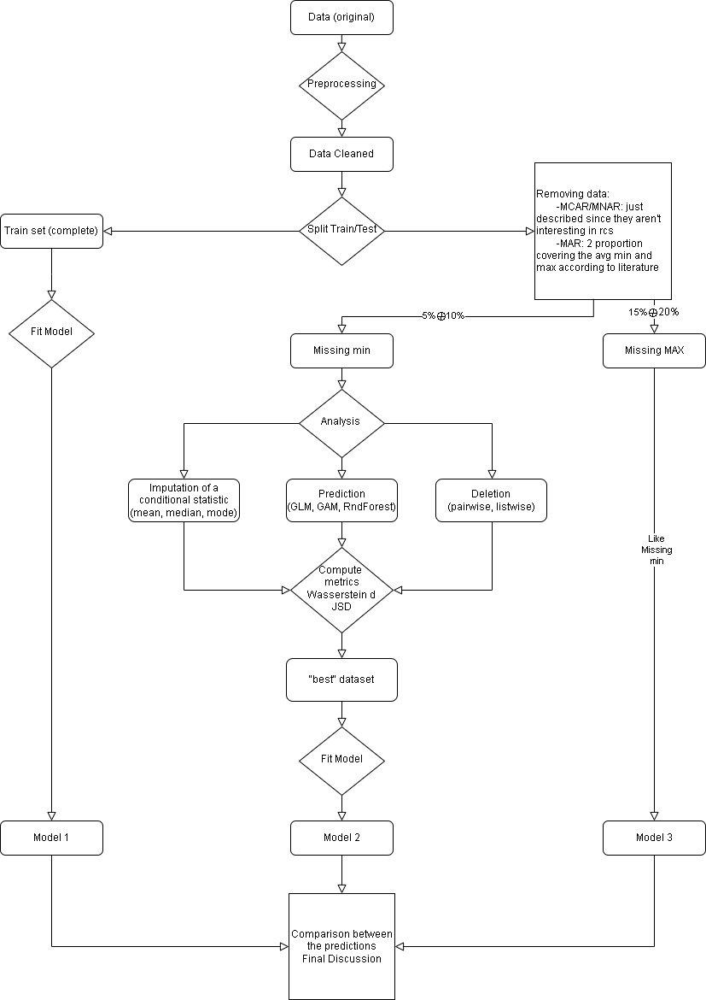

## Important note

Since most of the problems are data dependent, this work is a preliminary analysis that aims to show the flowchart of the project. Thus, some analysis are approximate and the models aren't tuned. The final experiment will be on a complete different dataset.

# Dealing with missing data

## Project Overview

This project focuses on analyzing Missing At Random (MAR) data patterns using simulated dataset. The analysis is conducted through various statistical methods to understand and handle missing data scenarios effectively. The entire experiment is guided by many metrics that give us a way to compare the results.

## TODO

> Currently many functions are just template pre-made to test things out

- Explore MAR (just mention the other and explain why we choose mar in the final report)

  > Showcase what happens

- Test for two different percentage 5% - 15% (or 10% - 20%, tbd)

- [x] Testing more complex imputation mechanisms
  - **Still missing**:
    - [ ] Multiple imputation
    - [ ] Some other possible ideas
- [ ] Test on more complex synthetic_datasets so that the GAM and Trees can shine
- [ ] Put everything in a cleaner and presentable format
- [ ] Implement the function to compute wasserstein distance (and Jensen-Shannon divegence?)
- [ ] Review functions inside [`synthetic_data.R`](src/synthetic_data.R)
- [x] Review functions inside [`missing_data.R`](src/missing_data.R)

#### Useful resources for mice:

> Possibly note needed

- [mice package](https://cran.r-project.org/web/packages/mice/mice.pdf)
- [First](https://www.youtube.com/watch?v=MpnxwNXGV-E)
- [Second](https://www.youtube.com/watch?v=sNNoTd7xI-4)

#### Resources from literature

> Everything that might be useful even in the future

- [Outliers and missing values](https://sci-hub.ru/10.1111/j.1440-1681.2007.04860.x)
- [Various imputation techniques in detail](https://www.researchgate.net/publication/220579612_Missing_Data_Imputation_Techniques)
- [Generating Synthetic Missing Data: A Review by Missing Mechanism](https://ieeexplore.ieee.org/document/8605316/)

## Project Structure

```bash
.
├── notebooks
│   ├── dataset_analysis
│   │   └── synthetic_data_analysis.Rmd
│   ├── final_results.Rmd
│   ├── synthetic_data_experiments.Rmd
│   └── setup.R
├── src
│   ├── inputation_methods.R
│   ├── metrics.R
│   ├── missing_data.R
│   ├── synthetic_data.R
│   └── utils.R
└── README.md
```

## Description

This project investigates Missing At Random (MAR) patterns in data using simulation studies. The primary objective is to develop and evaluate methodologies for handling missing data, with a focus on minimizing the divergence from the original data distribution and ensuring robust model performance.

The experiment begins with data cleaning and preprocessing, followed by an **80/20 train-test split** to facilitate performance comparison of various models. The analysis proceeds in two stages: the training set undergoes exploratory analysis and model fitting, serving as a baseline for evaluation; a cloned version of the training set is modified by introducing missing data through MAR mechanisms, simulating real-world scenarios of missingness.

Our primary goal is to impute or reconstruct the missing data to approximate the original distribution as closely as possible. The following techniques are employed for imputation:

- **Conditional statistics** (e.g., median, conditional mean),
- **Data deletion** strategies (e.g., pairwise and listwise deletion),
- **Predictive modeling** using various regression approaches (GLM, GAM, and Random Forest).

To measure the divergence between the original and imputed datasets, two key metrics are utilized: Wasserstein Distance to quantify distributional differences and Jensen-Shannon Divergence to measure the similarity between probability distributions.

After imputation, the datasets generated under different conditions (e.g., 5% and 15% missing data) are analyzed, and models are fitted to assess the quality of reconstruction. Finally, using standard prediction metrics, the performance of models trained on the imputed datasets is compared to those trained on the original dataset. This comparison allows for a comprehensive evaluation of the effectiveness of different imputation techniques.


##### The analysis includes:

- Data simulation procedures
- Analysis of the dataset (simulated and real dataset)
- Implementation of MAR and MCAR mechanisms
- Statistical analysis of missing patterns
- Evaluation of handling methods (exploring different imputation techniques)
- Performance metrics and results visualization

## Documentation

Detailed documentation is available in the following notebooks:

- [`synthetic_data_experiments.Rmd`](notebooks/synthetic_data_experiments.Rmd): Initial analysis, validation of different methods to deal with missing data on synthetic dataset
- [`synthetic_data_analysis.Rmd`](notebooks/dataset_analysis/synthetic_data_analysis.Rmd): Initial analysis of the dataset + artificial creation of missing data
- [`final_results.Rmd`](notebooks/final_results.Rmd): Comprehensive results and conclusions

#### Utilities

- [`synthetic_data.R`](src/synthetic_data.R): Functions to generate a synthetic dataset
- [`inputation_methods.R`](src/inputation_methods.R): Functions to implement different imputation techniques
- [`missing_data.R`](src/missing_data.R): Functions to artificially generate missing data
- [`metrics.R`](src/metrics.R): Functions to evaluate different strategies to handle missing data
- [`utils.R`](src/utils.R): Functions that are general utilities

## Preliminary Results

_Note: Preliminary results should be submitted 10 days before the exam for feedback on next steps._

## Project Complete structure



## Contributors

- Jacopo Zacchigna, Devid Rosa, Ludovica Bianchi, Cristiano Baldassi

---

_This project is part of the Statistical Methods Examination._
