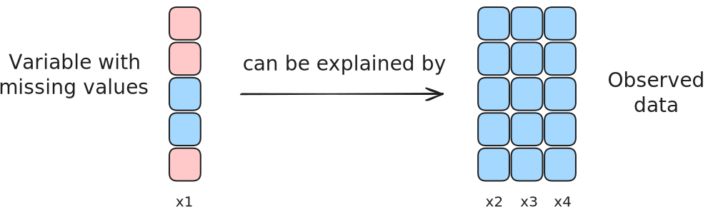

# Missing data study

### Environment Setup

> Everything is defined inside `setup.R`

```{r, echo = T}
# Load utilities
suppressMessages(library(here))

# Load utilities
source(here("src", "setup.R"))
```

## Missing value patterns

In statistical analysis, understanding the patterns of missing data is
crucial for selecting appropriate handling methods. The primary patterns
are:

**Univariate Missing Data**: Occurs when only a single variable has
missing values. This pattern is uncommon across most disciplines and
typically arises in experimental studies.

**Monotone Missing Data**: Characterized by a situation where the
missingness of one variable implies the missingness of all subsequent
variables. This pattern is often observed in longitudinal studies where
participants drop out and do not return. The monotone pattern is
generally easier to manage, as the missingness follows a clear,
observable sequence.

**Non-Monotone Missing Data**: Occurs when the missingness of one
variable does not predict the missingness of other variables. This
pattern is more complex and requires careful analysis to handle
appropriately.

{width="600"}

## Missing value generation mechanisms

Another way to classify missing values is based on their underlying
mechanism.

Rubin's missing data theory introduces a dataset $Y$ that is partitioned
into observed values ($Y_o$) and missing values ($Y_m$). The presence or
absence of data is tracked by an indicator matrix $R$ defined for each
element of $Y$ as:

$$
R = \begin{cases}
0 & \text{if } Y \text{ is observed} \\
1 & \text{if } Y \text{ is missing}
\end{cases}
$$

**Missing Completely at Random (MCAR)** defines a mechanism where the
probability of missingness $P(R|q)$ has no relationship with any values
in the dataset. Implementation can be univariate, where missing values
are inserted through random selection or Bernoulli trials with
probability $p$, or multivariate, where missing values are distributed
either uniformly or randomly across the entire dataset.

{width="650"}

**Missing At Random (MAR/CAR)** occurs when missingness probability
$P(R|Y_o, q)$ depends on observed data patterns but not on missing
values. For univariate cases, missing values are determined by the
patterns of observed data, such as rank-based probabilities or
percentile thresholds. In multivariate cases, missingness arises due to
relationships or correlations between feature pairs.

{width="650"}

**Missing Not at Random (MNAR)**: Missingness depends on both the
observed and unobserved data $p(R|Y_0,Y_m,q)$, making it difficult to
model and handle. Identifying and managing MNAR data requires complex
assumptions about the relationship between missing and observed values.

{width="650"}

This study focuses on Missing at Random (MAR) data due to its practical
relevance and analytic tractability compared to Missing Completely at
Random (MCAR) and Missing Not at Random (MNAR).

We exclude Missing Completely at Random (MCAR) data because its
randomness preserves the dataset’s underlying distribution, making
missingness equivalent to reduced sample size without introducing bias.
Handling MNAR (Missing Not at Random) data is beyond this study’s scope
because identifying and modeling its dependence on unobserved variables
is often ambiguous and requires unverifiable assumptions.

### Synthetic MAR mechanism

Let's create a simple dataset to demonstrate the different mechanisms of
missing values and explore various ways to visualize them.

```{r, echo=T, class.source = 'fold-show'}
synthetic_data <- synthetic_dataset_gen(n_samples = 500, 
                                        n_covariates = 5, 
                                        correlation = "none", 
                                        target_type = "linear", 
                                        noise_level = 0.5)
```

#### Censoring method

The `delete_MAR_censoring` function introduces missing values in a
dataset based on a MAR mechanism. Missingness depends on values in a
**control column** (`cols_ctrl`). Censoring mechanism:

-   **Sorting based**: Rows are sorted by the control column, and
    missing values are added to the smallest, largest, or both extremes.
-   **Quantile based**: Missing values are based on calculated quantiles
    of the control column, without sorting.
    
{width="650"}

```{r}
data.MAR.uni <- delete_MAR_censoring(synthetic_data, p = 0.1, cols_mis = c('X1'), cols_ctrl = c('X2'))
aggr(data.MAR.uni, sortVars=TRUE, plot = TRUE, numbers = TRUE , labels=names(synthetic_data), col = nord_contrast)

# Create a new dataset indicating missing status
intersection_dataset <- synthetic_data
intersection_dataset$missing <- ifelse(is.na(data.MAR.uni$X1), "Missing", "Present")

plot_missing_data(data.MAR.uni, "MAR uni", c("white", red_nord))
```

```{r, fig.width=10, fig.height=10}
# Calculate global ranges for X1 and all Y variables (X2-X5)
x_range <- range(synthetic_data$X1, na.rm = TRUE)
y_range <- range(synthetic_data[,paste0("X", 2:5)], na.rm = TRUE)

# Add padding to ranges
x_pad <- diff(x_range) * 0.05
y_pad <- diff(y_range) * 0.05

# Plot for X1 vs X2
plot_data2 <- data.frame(
  X1 = synthetic_data$X1,
  Y = synthetic_data$X2,
  missing = ifelse(is.na(data.MAR.uni$X1), "Missing", "Present")
)

scatter_plot2 <- ggplot(plot_data2, aes(x = X1, y = Y, color = missing)) +
  geom_point() +
  scale_color_manual(values = c("Missing" = red_nord, "Present" = "black")) +
  scale_x_continuous(limits = c(x_range[1] - x_pad, x_range[2] + x_pad)) +
  scale_y_continuous(limits = c(y_range[1] - y_pad, y_range[2] + y_pad)) +
  theme_minimal() +
  labs(color = "Data Status", x = "X1", y = "X2") +
  theme(legend.position = "none") +
  coord_fixed()

final_plot2 <- ggMarginal(scatter_plot2, margins = "y", 
                         groupColour = TRUE, groupFill = TRUE,
                         type = "boxplot", size = 10, width = 0.15, outlier.size = 1)

# Plot for X1 vs X3
plot_data3 <- data.frame(
  X1 = synthetic_data$X1,
  Y = synthetic_data$X3,
  missing = ifelse(is.na(data.MAR.uni$X1), "Missing", "Present")
)

scatter_plot3 <- ggplot(plot_data3, aes(x = X1, y = Y, color = missing)) +
  geom_point() +
  scale_color_manual(values = c("Missing" = red_nord, "Present" = "black")) +
  scale_x_continuous(limits = c(x_range[1] - x_pad, x_range[2] + x_pad)) +
  scale_y_continuous(limits = c(y_range[1] - y_pad, y_range[2] + y_pad)) +
  theme_minimal() +
  labs(color = "Data Status", x = "X1", y = "X3") +
  theme(legend.position = "none") +
  coord_fixed()

final_plot3 <- ggMarginal(scatter_plot3, margins = "y",
                         groupColour = TRUE, groupFill = TRUE,
                         type = "boxplot", size = 10, width = 0.15, outlier.size = 1)

# Plot for X1 vs X4
plot_data4 <- data.frame(
  X1 = synthetic_data$X1,
  Y = synthetic_data$X4,
  missing = ifelse(is.na(data.MAR.uni$X1), "Missing", "Present")
)

scatter_plot4 <- ggplot(plot_data4, aes(x = X1, y = Y, color = missing)) +
  geom_point() +
  scale_color_manual(values = c("Missing" = red_nord, "Present" = "black")) +
  scale_x_continuous(limits = c(x_range[1] - x_pad, x_range[2] + x_pad)) +
  scale_y_continuous(limits = c(y_range[1] - y_pad, y_range[2] + y_pad)) +
  theme_minimal() +
  labs(color = "Data Status", x = "X1", y = "X4") +
  theme(legend.position = "none") +
  coord_fixed()

final_plot4 <- ggMarginal(scatter_plot4, margins = "y",
                         groupColour = TRUE, groupFill = TRUE,
                         type = "boxplot", size = 10, width = 0.15, outlier.size = 1)

# Plot for X1 vs X5
plot_data5 <- data.frame(
  X1 = synthetic_data$X1,
  Y = synthetic_data$X5,
  missing = ifelse(is.na(data.MAR.uni$X1), "Missing", "Present")
)

scatter_plot5 <- ggplot(plot_data5, aes(x = X1, y = Y, color = missing)) +
  geom_point() +
  scale_color_manual(values = c("Missing" = red_nord, "Present" = "black")) +
  scale_x_continuous(limits = c(x_range[1] - x_pad, x_range[2] + x_pad)) +
  scale_y_continuous(limits = c(y_range[1] - y_pad, y_range[2] + y_pad)) +
  theme_minimal() +
  labs(color = "Data Status", x = "X1", y = "X5") +
  theme(legend.position = "none") +
  coord_fixed()

final_plot5 <- ggMarginal(scatter_plot5, margins = "y",
                         groupColour = TRUE, groupFill = TRUE,
                         type = "boxplot", size = 10, width = 0.15, outlier.size = 1)

# Arrange the plots in a 2x2 grid
grid.arrange(final_plot2, final_plot3, final_plot4, final_plot5, ncol = 2)

```

#### Likelihood method

The `delete_MAR_1_to_x()` function in R creates MAR values by
controlling missingness in one column (`cols_mis`) based on the values
of another column (`cols_ctrl`). It splits the data into two groups
using a cutoff value (e.g., median) in `cols_ctrl`. Group 1 contains
rows below the cutoff, and group 2 contains rows above. The `x`
parameter sets the odds ratio of missing data: for `x = 3`, group 2 is
**3 times** more likely to have missing values than group 1.

{width="650"}

```{r}
data.MAR.multi <- delete_MAR_1_to_x(synthetic_data, 
                                    p = 0.2, 
                                    cols_mis = c('X1'), 
                                    cols_ctrl = c('X3'), 
                                    x = 50)

data.MAR.multi <- delete_MAR_1_to_x(data.MAR.multi, 
                                    p = 0.2, 
                                    cols_mis = c('X1'), 
                                    cols_ctrl = c('X4'), 
                                    x = 50)

data.MAR.multi <- delete_MAR_1_to_x(data.MAR.multi, 
                                    p = 0.2, 
                                    cols_mis = c('X2'), 
                                    cols_ctrl = c('X5'), 
                                    x = 50)

par(mfcol=c(2, 2))
aggr(data.MAR.multi, 
     sortVars=TRUE, 
     plot = TRUE, 
     numbers = TRUE , 
     labels=names(synthetic_data), 
     col = nord_contrast)

plot_missing_data(data.MAR.multi, "MAR multi", c("white", red_nord))
```

```{r, fig.width=10, fig.height=10}
# Calculate global ranges for X1 and all Y variables (X2-X5)
x_range <- range(synthetic_data$X1, na.rm = TRUE)
y_range <- range(synthetic_data[,paste0("X", 2:5)], na.rm = TRUE)

# Add padding to ranges
x_pad <- diff(x_range) * 0.05
y_pad <- diff(y_range) * 0.05

# Plot for X1 vs X2
plot_data2 <- data.frame(
  X1 = synthetic_data$X1,
  Y = synthetic_data$X2,
  missing = ifelse(is.na(data.MAR.multi$X1), "Missing", "Present")
)

scatter_plot2 <- ggplot(plot_data2, aes(x = X1, y = Y, color = missing)) +
  geom_point() +
  scale_color_manual(values = c("Missing" = red_nord, "Present" = "black")) +
  scale_x_continuous(limits = c(x_range[1] - x_pad, x_range[2] + x_pad)) +
  scale_y_continuous(limits = c(y_range[1] - y_pad, y_range[2] + y_pad)) +
  theme_minimal() +
  labs(color = "Data Status", x = "X1", y = "X2") +
  theme(legend.position = "none") +
  coord_fixed()

final_plot2 <- ggMarginal(scatter_plot2, margins = "y", 
                         groupColour = TRUE, groupFill = TRUE,
                         type = "boxplot", size = 10, width = 0.15, outlier.size = 1)

# Plot for X1 vs X3
plot_data3 <- data.frame(
  X1 = synthetic_data$X1,
  Y = synthetic_data$X3,
  missing = ifelse(is.na(data.MAR.multi$X1), "Missing", "Present")
)

scatter_plot3 <- ggplot(plot_data3, aes(x = X1, y = Y, color = missing)) +
  geom_point() +
  scale_color_manual(values = c("Missing" = red_nord, "Present" = "black")) +
  scale_x_continuous(limits = c(x_range[1] - x_pad, x_range[2] + x_pad)) +
  scale_y_continuous(limits = c(y_range[1] - y_pad, y_range[2] + y_pad)) +
  theme_minimal() +
  labs(color = "Data Status", x = "X1", y = "X3") +
  theme(legend.position = "none") +
  coord_fixed()

final_plot3 <- ggMarginal(scatter_plot3, margins = "y",
                         groupColour = TRUE, groupFill = TRUE,
                         type = "boxplot", size = 10, width = 0.15, outlier.size = 1)

# Plot for X1 vs X4
plot_data4 <- data.frame(
  X1 = synthetic_data$X1,
  Y = synthetic_data$X4,
  missing = ifelse(is.na(data.MAR.multi$X1), "Missing", "Present")
)

scatter_plot4 <- ggplot(plot_data4, aes(x = X1, y = Y, color = missing)) +
  geom_point() +
  scale_color_manual(values = c("Missing" = red_nord, "Present" = "black")) +
  scale_x_continuous(limits = c(x_range[1] - x_pad, x_range[2] + x_pad)) +
  scale_y_continuous(limits = c(y_range[1] - y_pad, y_range[2] + y_pad)) +
  theme_minimal() +
  labs(color = "Data Status", x = "X1", y = "X4") +
  theme(legend.position = "none") +
  coord_fixed()

final_plot4 <- ggMarginal(scatter_plot4, margins = "y",
                         groupColour = TRUE, groupFill = TRUE,
                         type = "boxplot", size = 10, width = 0.15, outlier.size = 1)

# Plot for X1 vs X5
plot_data5 <- data.frame(
  X1 = synthetic_data$X1,
  Y = synthetic_data$X5,
  missing = ifelse(is.na(data.MAR.multi$X1), "Missing", "Present")
)

scatter_plot5 <- ggplot(plot_data5, aes(x = X1, y = Y, color = missing)) +
  geom_point() +
  scale_color_manual(values = c("Missing" = red_nord, "Present" = "black")) +
  scale_x_continuous(limits = c(x_range[1] - x_pad, x_range[2] + x_pad)) +
  scale_y_continuous(limits = c(y_range[1] - y_pad, y_range[2] + y_pad)) +
  theme_minimal() +
  labs(color = "Data Status", x = "X1", y = "X5") +
  theme(legend.position = "none") +
  coord_fixed()

final_plot5 <- ggMarginal(scatter_plot5, margins = "y",
                         groupColour = TRUE, groupFill = TRUE,
                         type = "boxplot", size = 10, width = 0.15, outlier.size = 1)

# Arrange the plots in a 2x2 grid
grid.arrange(final_plot2, final_plot3, final_plot4, final_plot5, ncol = 2)

```

## Performance metrics between Datasets

Since we possess the **original dataset prior to the introduction of
missing values**, we will introduce *two metrics* to compare *the
distributions of two datasets*: the **original dataset** without missing
values and the dataset in which missing values have been **imputed**
using various techniques

We indeed care about comparing the distribution of the two datasets more
than comparing pointwise the actual reconstruction of the dataset.

-   The **Jensen–Shannon Divergence (JSD)** quantifies the similarity or
    divergence between two probability distributions $P$ and $Q$. It is
    based on the midpoint distribution $M = \frac{1}{2}(P + Q)$ and is
    calculated as the average of the Kullback-Leibler (KL) divergences
    of $P$ and $Q$ relative to $M$. JSD is symmetric and always
    non-negative, with values ranging between $0$ (identical
    distributions) and $\log(2)$ (distributions with disjoint supports).

-   The **Wasserstein distance**, which involves spatial costs, JSD
    operates on the information-theoretic differences between
    distributions and can be transformed into a metric by taking its
    square root, satisfying the triangle inequality. These two metrics
    serve different purposes: while the Wasserstein distance considers
    the geometry of the underlying space, JSD focuses on statistical
    divergence.

```{r, echo = FALSE}
# Define the child RMarkdown file path
part_1 <- here("notebooks", "partial_analyses", "part_1.Rmd")
```

```{r, child = here("notebooks", "partial_analyses", "part_1.Rmd"), cache = TRUE}
# Run the file which does data analyses even if not knitted by runned manually
rmarkdown::render(part_1)
```

```{r, echo = FALSE}
# Define the child RMarkdown file path
part_2 <- here("notebooks", "partial_analyses", "part_2.Rmd")
```

```{r, child = here("notebooks", "partial_analyses", "part_2.Rmd"), cache = TRUE}
rmarkdown::render(part_2)
```

# Conclusions and Recommendations

*(Add your conclusions and recommendations based on the analysis
results)*

-   We tried different methods of adding noise, but this approach
    appears to be both "simple" (as supported by the literature) and
    effective. However, the drawback might be that it does not
    adequately account for the heteroscedasticity of the dataset.

-   We did not explore the Bayesian approach, but it is currently quite
    useful and interesting. We believe that delving deeper into this
    area would be a worthwhile continuation.

-   We did not investigate categorical variables, as they were somewhat
    outside the scope of this study. However, we believe that decision
    trees could perform well in this context.

-   We did not extensively explore the removal of multiple variables...

## Appendix

#### Notes on Missing Data Mechanisms

-   MCAR: Missingness is unrelated to data values.
-   MAR: Missingness depends on observed values.
-   MNAR: Missingness depends on unobserved data (not really interesting
    to deal with) \> Can pretty much always be reconducted to MAR

#### References

> Need to add references

```{r}
citation("pROC")
```

-   ...
-   
